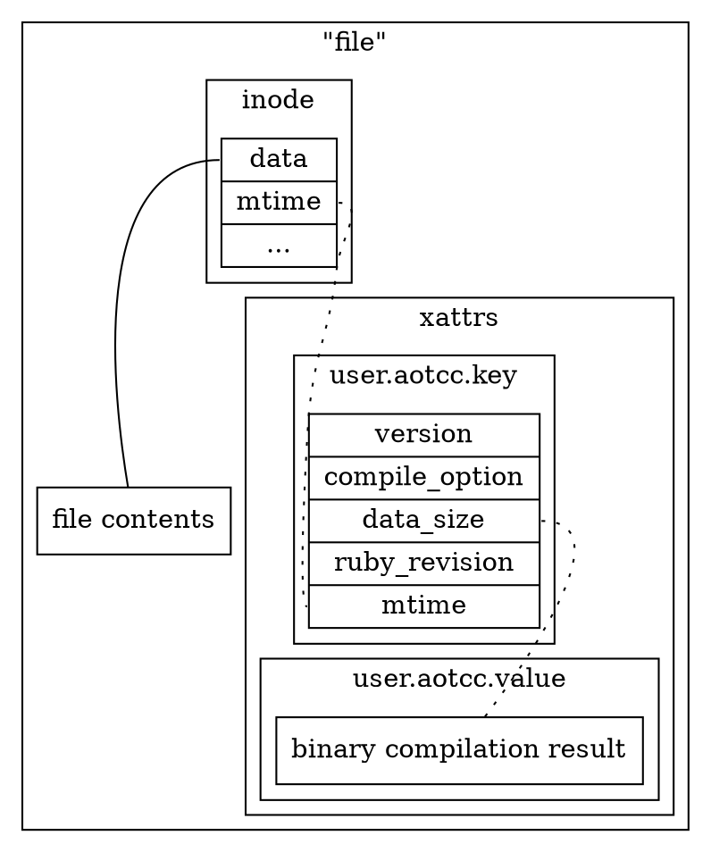

---
title: Bootsnap Compile Cache Semantics
date: 2017-03-31
...

Just a quick diagram I'm throwing together for the README:

```dot
graph {
  subgraph cluster_0 {
    label = "\"file\"";
    d [ shape=record, label="file contents" ];

    subgraph cluster_1 {
      label="inode";
      f [ shape=record, label="{<fd> data | <fm> mtime | ...}" ];
    }

    f:fd -- d;

    subgraph cluster_2 {
      label = "xattrs";
      subgraph cluster_3 {
        label = "user.aotcc.key";
        a [ shape=record, label="{version | compile_option | <fds> data_size | ruby_revision | <fm> mtime}" ];
      }
      subgraph cluster_4 {
        label = "user.aotcc.value";
        b [ shape=record label="binary compilation result" ];
      }
      a:fds -- b [style=dotted];
    }
  }

  f:fm -- a:fm [ style=dotted ];
}
```
