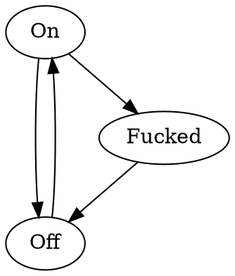

---
title: On, Off, Fucked
date: 2020-01-22
toc: false
...

At Shopify, we have a little Virtual Machine runner called Railgun, which runs all of the datastores
and other accessory processes required to run an application on a developer laptop. Think of it as
a pre-composed docker-compose, packaged up as a VM, running as a single process mostly hidden from
the user.

An interesting aspect of the way Railgun works, which we talk about a lot internally to my team, but
haven't shared much outside, is that we were very purposeful about making it easy to reason about
for its users when things inevitably go wrong.

Software will tend to lead people towards some mental model or another of itself in the people that
interact with it, over the course of a number of interactions. Railgun tries to encourage people to
understand a Railgun VM in terms of three states: **On**, **Off**, and **Fucked**. On and off are
obvious: The VM is running and healthy, or not running. The final state is a conscious attempt to
collapse any other possible failure into a single slot in the user's mental model. Rather than
forcing the user to understand the various ways a complex collection of software can fail, we teach
users about a single command they can run to correct essentially any error that would arise (`dev
reset-railgun`). The trade-off we make is that this is a very non-subtle solution. We could have far
more elegant solutions to most problems that do actually arise, but in this case we trade that off
against operational simplicity for our developers.

This three-state mental model that we try to program into people makes it really easy for them to
rationalize about which state they're in and how to transition between them.
