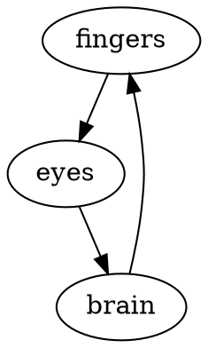

An interesting piece of how a lot of people interact with their computers: Cmd+Tab (or Alt+Tab, or
whatever) for application switching.

This is an interesting hybrid of recognition and recall: You may remember that the last application
you used is just one press away, but it will likely take you a bit more work to get to, say,
1Password. If you don't *recall* how many taps away the application you want is, you're setting up
an interactive loop with your computer: you press buttons, watch the result, process visual input,
and press more buttons.



I use a tool called [Hammerspoon](https://www.hammerspoon.org/) to create a few keybindings to
mostly eliminate this recognition-based loop from my day-to-day computer usage. Each application
that I commonly use is [bound to its own (recall-based) key
chord](https://github.com/burke/b/blob/4e688f4a317bf88afb737af995340f9c8145a233/etc/hammerspoon/init.lua#L37-L47):

```lua
appbindings.setup({"cmd", "ctrl"}, {
  [1] = "com.googlecode.iterm2",
  [2] = "com.apple.Music",
  [3] = "com.brave.Browser",
  [4] = "com.tinyspeck.slackmacgap",
  [5] = "org.gnu.Emacs",
  [6] = "com.apple.iChat",
  [7] = nil,
  [8] = "com.microsoft.vscode",
  [9] = nil,
})
```

This saves me, I don't know, a quarter of second about a hundred times a day. Little things add up,
especially in the middle of focused thought.
