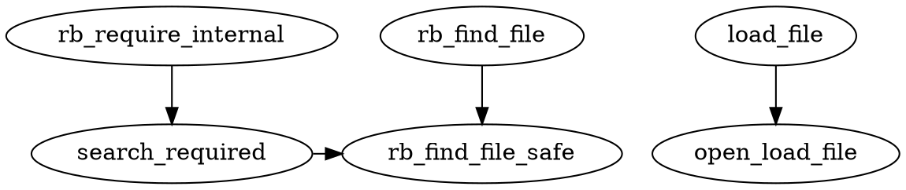
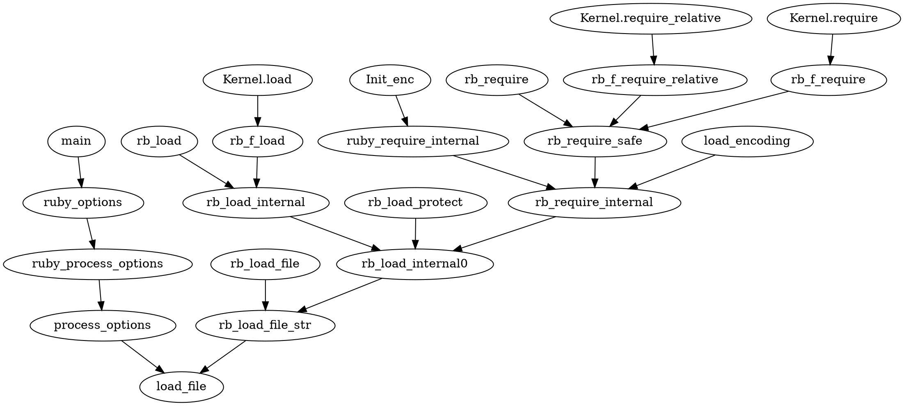

### Monday

Ok, so I'm going to try to build a ruby that just skips this check altogether to see what kind of
performance difference there is. Looks like I'll have to modify `rb_find_file_safe`...

```diff
diff --git a/file.c b/file.c
index e299244..14a4003 100644
--- a/file.c
+++ b/file.c
@@ -5824,7 +5824,6 @@ rb_find_file_safe(VALUE path, int safe_level)
        if (safe_level >= 1 && !fpath_check(path)) {
            rb_raise(rb_eSecurityError, "loading from unsafe path %s", f);
        }
-       if (!rb_file_load_ok(f)) return 0;
        if (!expanded)
            path = copy_path_class(file_expand_path_1(path), path);
        return path;
```

This appears successful: The total number of FS-access syscalls is reduced by 13% from 132k to 114k.
Let's see if system time changes:

| patched 2.3.3| 2.3.3 |
|-|-|
| 1.03 | 1.03 |
| 0.94 | 0.97 |
| 0.94 | 0.98 |
| 0.94 | 1.03 |
| 0.95 | 0.96 |
| 0.92 | 0.98 |
| 0.96 | 0.97 |
| *μ : 0.954* | *μ : 0.989* |

Well, it appears to result in a 3.5% reduction of system time, representing about 35ms saved during
`bin/rake environment`.

[dtrace](https://github.com/burke/dotfiles/blob/master/.config/dtrace/fs-access.d) confirms the
expected behaviour:

```
open	.../eagerlib/config_hash.rb
fstat64	.../eagerlib/config_hash.rb
fgetxattr	.../eagerlib/config_hash.rb
fgetxattr	.../eagerlib/config_hash.rb
close	.../eagerlib/config_hash.rb
open	.../eagerlib/secrets.rb
fstat64	.../eagerlib/secrets.rb
fgetxattr	.../eagerlib/secrets.rb
fgetxattr	.../eagerlib/secrets.rb
close	.../eagerlib/secrets.rb
```

This isn't quite a realistic solution yet, since we should make sure to surface the same error if
the user tries to require a directory or an unreadable file, but the performance characteristics of
a real solution should match this.

With this patch now, we can reproduce some undesired behaviour:

```
$ touch foo.rb
$ chmod 000 foo.rb
$ bad-ruby -e 'require "./foo.rb"'
...:55:in `require': Permission denied -- ... (LoadError)
$ good-ruby -e 'require "./foo.rb"'
...:in `require': cannot load such file -- ... (LoadError)
```

This appears to be a valid implementation of the solution:
<https://gist.github.com/burke/95f05cc9878e8564bad76eb0fed9876e>

This solves the problem for when we're using `load_iseq` -- but it seems like we could actually
enhance this to roll the `fstat64` into the actual file read performed in the default path too.

That is, currently without bootsnap, we see things like:

```
open	foo.rb
fstat64	foo.rb
close	foo.rb
open	foo.rb
fstat64	foo.rb
fstat64	foo.rb
read	foo.rb
close	foo.rb
```

There's clearly no legitimate reason this need be anything more than:

```
open	foo.rb
fstat64	foo.rb
read	foo.rb
close	foo.rb
```

The leaf of the above change is `rb_load_internal0`. If we push the deferred check into
`rb_load_file_str` and possibly beyond, we can probably kill these extra syscalls too.

Looking through the `rb_load_file_str` code though, it seems that ruby actually does all the same
checks as `rb_find_file_safe` there, so we really don't need to assert anything different at all --
in fact, we can scale back how far down we pass the information about deferring the checks. The only
behavioural difference is that some of the errors are a bit more specific. Like we saw above,
`rb_load_file_str` will raise a `LoadError` indicating `EPERM` instead of a generic one when the
file can't be read because of a permissions problem. We could potentially change this back but it
seems okay maybe?

And indeed, we now get this syscall sequence:

```
open	foo.rb
fstat64	foo.rb
fstat64	foo.rb
read	foo.rb
close	foo.rb
```

We still have two `fstat64` calls though, because of this block in `open_load_file`:

```c
#ifdef S_ISFIFO
        {
            struct stat st;
            if (fstat(fd, &st) != 0) {
                e = errno;
                (void)close(fd);
                rb_load_fail(fname_v, strerror(e));
            }
            if (S_ISFIFO(st.st_mode)) {
                /*
                  We need to wait if FIFO is empty. It's FIFO's semantics.
                  rb_thread_wait_fd() release GVL. So, it's safe.
                */
                rb_thread_wait_fd(fd);
            }
        }
#endif
        if (!ruby_is_fd_loadable(fd)) {
            e = errno;
            (void)close(fd);
            rb_load_fail(fname_v, strerror(e));
```

What's happening here is that, if we're on non-windows (`S_ISFIFO`), we stat the fd and perform some
check on the statbuf. Then, unconditionally, we check whether the fd is loadable, which performs
another `fstat64`. What we would like to do is reuse the `struct stat` from line 3 for the call to
`ruby_is_fd_loadable` toward the end. This gets kind of awkward for cross-platform though, because
`struct stat` probably isn't defined on windows.

I ended up just replicating the body of `ruby_is_fd_loadable` inside the `S_ISFIFO` branch.

#### Results

Here's the final PoC diff: <https://gist.github.com/burke/42b069faa64821afa085dbe2a770e44f>

With this diff, we're down to:

```
open	foo.rb
fstat64	foo.rb
read	foo.rb
close	foo.rb
```

Success!

The benefit here is only relevant when files are required by absolute path, but this changes the
number of syscalls:

* from 3 to 0 when `load_iseq` is in use;
* from 8 to 4 otherwise.

---

### Tuesday

I realize the error message needs to be identical to the current version. For example, [rails
specifically
detects](https://github.com/rails/rails/blob/master/activesupport/lib/active_support/core_ext/load_error.rb#L2-L7)
a small number of messages for `LoadError`. Ruby is capable of throwing many more, but only if the
file became invalid after `ruby_is_fd_loadable` (which masks all specific errors as "cannot load
such file", and doesn't get called with this new patch in some circumstances), but before actually
loading the file, where `errno` is propagated into the error message in some situations.

This causes, for example, `LoadError`s indicating `EPERM` when the file is unreadable, where before
it would simply be "cannot load such file".

First, let's look at all the callers of the modified methods. In this diagram, the heavy-bordered
pink boxes are the substantatively-modified functions. The arrows represent every caller of this
function. If all of the root nodes' APIs are unchanged, this change has had no visible effect.



So the functions we have to consider are:

* `rb_find_file`;
* `load_file`;
* `rb_require_internal`.

#### `load_file`

The modification to `open_load_file` is as follows:

```diff
diff --git a/ruby.c b/ruby.c
index c780937..dd580bf 100644
--- a/ruby.c
+++ b/ruby.c
@@ -1824,5 +1824,13 @@ open_load_file(VALUE fname_v, int *xflag)
                rb_thread_wait_fd(fd);
+           } else if (S_ISDIR(st.st_mode)) {
+               (void)close(fd);
+               rb_load_fail(fname_v, strerror(EISDIR));
+           } else if (!S_ISREG(st.st_mode)) {
+               (void)close(fd);
+               rb_load_fail(fname_v, strerror(ENXIO));
            }
        }
-#endif
+#else
+       /* Note that we've replicated ruby_is_fd_loadable in S_ISFIFO without
+        * calling fstat64 twice. */
        if (!ruby_is_fd_loadable(fd)) {
@@ -1832,2 +1840,3 @@ open_load_file(VALUE fname_v, int *xflag)
        }
+#endif
```

The first 6 additions replicate the behaviour of `ruby_is_fd_loadable` in a conditional branch
without having to `fstat(fd)` again. The failure in the second branch looks like:

```c
e = errno;
(void)close(fd);
rb_load_fail(fname_v, strerror(e));
```

...and we have preserved that behaviour in the first branch, but there's a catch, because when
`ruby_is_fd_loadable` is called earlier, by `rb_find_file`, the same error is collected there, and
`errno` is not propagated. We'll probably have to change this, but let's see what we find in the
other two modified functions.

#### `rb_find_file`

The function body is now:

```c
return rb_find_file_safe(path, rb_safe_level(), 0);
```

The value `0` for `defer_load_check` preserves the previous behaviour, so we're already good here.

#### `rb_require_internal`

This function is called from `load_encoding`, `rb_require_safe`, and `ruby_require_internal`, which
continue to fan out a bit.

So, the change to `search_required` is:

* If the file is an absolute path ending with ".rb":
    * If the path represents an unreadable file, a directory or any other non-reg/non-fifo object:
        * Instead of returning `0`, return `'r'`.

This manifests as the following change to `ruby_require_internal`:

* If the file is an absolute path ending with ".rb":
    * If the path represents an unreadable file, a directory or any other non-reg/non-fifo object:
        * Instead of raising a generic `LoadError`, call `rb_load_internal0` $\to$
          `rb_load_file_str` $\to$ `load_file`.

Now here's where `load_file` becomes a problem. We want it to raise a generic error, not the
specific one. The easy solution here is to just change `load_file` to strip `errno` info from all
the errors it raises. Let's look through callers of `load_file` to see if anyone will care:



The eventual API here is:

* `main`, via command-line flags;
* `Kernel.load`, `Kernel.require`, `Kernel.require_relative`;
* `rb_require` via `ruby.h`;
* `Init_enc` and various encoding methods that force autoloading via `load_encoding`.

The easiest solution to this problem would be to simply remove the `errno` information from the
check that occurs while opening the file, to replicate the behaviour of the sometimes-missing
ahead-of-time check.

We can test this in all these cases by making the file to load unreadable and checking that we get
"cannot load such file" instead of "Permission denied" using a mainline ruby build. If no path leads
to "Permission denied", it's safe to simply strip `errno`.

`Kernel.require`
: ["cannot load such file"]{style="color:green"}

`Kernel.load`
: ["cannot load such file"]{style="color:green"}

`Kernel.require_relative`
: [*(irrelevant; this method rejects absolute paths)*]{style="color:green"}

`Init_enc`
: [*(irrelevant; encodings are always searched for on the `$LOAD_PATH`)*]{style="color:green"}

`load_encoding`
: [*(irrelevant; encodings are always searched for on the `$LOAD_PATH`)*]{style="color:green"}

`rb_require`
: ["cannot load such file"]{style="color:green"}

`main`
: `ruby: Permission denied -- /tmp/test/a.rb (LoadError)`{style="color:red;"}

So we're left with two options:

1. Strip the `errno` info unconditionally, degrading error specificity when a
   script argument on the CLI isn't loadable.
2. Special-case `process_options`, probably by passing an argument to `load_file`.

Let's go with #2. Since the only callers of `load_file` are `process_options` and
`rb_load_file_str`, this is a cheap modification, and preserves behaviour completely. In fact, the
`script` argument to `load_file` already represents this distinction! This makes for a simple
change:

<https://gist.github.com/burke/713ca8fc1d2915ac1b176d4e9d51e54b>

Now, the final change. This, as far as I know, raises all the same errors as before:

<https://gist.github.com/burke/fde10664779077ba495e4c7be92d44e1>

I've opened an issue on ruby-core: <https://bugs.ruby-lang.org/issues/13378>
