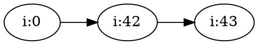
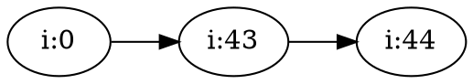

---
title: TLA<sup>+</sup>
subtitle: Notes from <a href="http://lamport.azurewebsites.net/video/intro.html">Leslie Lamport's Course</a>
date:  2017-03-20
...
## Intro

*See <http://lamport.azurewebsites.net/video/intro.html>.*

TLA$^+$ is a set of tools to construct and verify high-level models of digital
systems, especially concurrent and distributed systems. "High-level" in this
case means design-level -- above code-level. It can be used to verify designs
for complex systems before writing any code.

There are several tools:

* Probably most useful, TLC, or the TLA$^+$ Model checker;
* TLAPS, a proof assistant (proving programs are correct is a lot of work and
  this may rarely be useful);
* TLA$^+$ Toolbox, an IDE.

Even when TLA$^+$ is not useful, the mental model provided by learning it may be
useful as a way of conceptualizing problems.

Lamport asserts that abstraction is very important and that learning TLA$^+$ will
make you better at abstraction.

Amazon (AWS) has used TLA$^+$ on 14 large systems as of 2014, and feel it has
provided significant confidence. Engineers have been able to learn TLA$^+$ and get
useful results within 2-3 weeks.

> In every case, TLA$^+$ has added significant value.

### Fundamental Abstraction of TLA$^+$

The core idea of TLA$^+$ is that an individual execution of a system can be modeled
as a sequence of discrete steps.

In TLA$^+$, a 'step' is a state change -- i.e. an execution is represented as
a sequence of states, and a step is a transition from one state to the next.

### State Machines

TLA$^+$ is used to describe the sequence of states of a system, or its behaviour.
These systems can include programming languages, hardware description languages,
automata, turing machines, etc. These are modeled by state machines in TLA$^+$.

A state machine consists of two elements:

1. A set of initial states
2. A set of next possible states for each current state.

The machine halts if there is no possible next state.

#### Example

There's an example of representing a C program as a state machine:

```c
int i;
void main() {
  i = someNumber(); // random from 1 to 1000
  i++;
}
```

The initial state appears to be $[i:0]$, and for one example execution, we have:



Thus, the valid transitions are $[i:0] \to [i:42]$, and $[i:42]
\to [i:43]$. $[i:43]$ is a terminal state.

However, with a different random return from `someNumber`{.c}, we get:



In this case, our previous assertion that $[i:43]$ is a terminal state is
invalid. The problem is that there is other state hidden by programming
languages that state machines won't hide. This data is the call stack, the heap,
the program counter, and so on. In this case, specifically, the program counter.

So we revise our model as, roughly:

* $[i:0,l:3] \to [i:0,l:x | 0 \lt x \le 1000]$
* $[i:x,l:4 | 0 \lt x \le 1000] \to [i:x+1,l:5 | 1 \lt x \le 1001]$
* $[i:x,l:5]\;\text{(terminal)}$

This probably isn't that TLA$^+$ looks like, at all, but the main thing is that all
the implicit data managed by the OS and the language runtime has to be made very
explicit in the state machine.

## State Machines in TLA$^+$

TLA$^+$'s description language is not similar to familiar programming languages. It
is mathematical. This forces us to think more abstractly about the system, which
can improve the system.

Initial state:

```tla
(i = 0) /\ (pc = "start")
```

Next state:

```tla
IF pc = "start"
  THEN (pc' = "middle") /\
       (i' \in 1..1000)
  ELSE IF pc = "middle"
    THEN (pc' = "done") /\
         (i' = i + 1)
    ELSE FALSE
```

This is apparently a TLA$^+$ formula.

We can write it better as:

```tla
\/ /\ pc = "start"
   /\ pc' = "middle"
   /\ i' \in 1..1000
\/ /\ pc = "middle"
   /\ pc' = "done"
   /\ i' = i + 1
```

The first $\vee$ and the first $\wedge$ of each group are a special feature to
work like bulleted lists without weird parentheses that are hard to line up, but
essentially this reads as $\text{(first three lines)}\ \vee\ \text{(last three
lines)}$.

This is a more expressive way to express the computation than the C code in a
meaningful way: `i' \in 1..1000`{.tla} in particular expresses nondeterminism,
which C cannot.

Here's the full version:

```tla
---- MODULE SimpleProgram ----
EXTENDS Integers
VARIABLES i, pc

Init == (i = 0) /\ (pc = "start")

Next == \/ /\ pc = "start"
           /\ pc' = "middle"
           /\ i' \in 1..1000
        \/ /\ pc = "middle"
           /\ pc' = "done"
           /\ i' = i + 1
==============================
```

Dunno how necessary / what the deal with the dashes and equals signs is/are.

Definitions can be extracted when complexity warrants it, e.g.:


```tla
Pick == /\ pc = "start"
        /\ pc' = "middle"
        /\ i' \in 1..1000

Add1 == /\ pc = "middle"
        /\ pc' = "done"
        /\ i' = i + 1

Next == Pick \/ Add1
```

## Lecture 3?

This is the end of the available lectures. I'll revisit when there are more.
